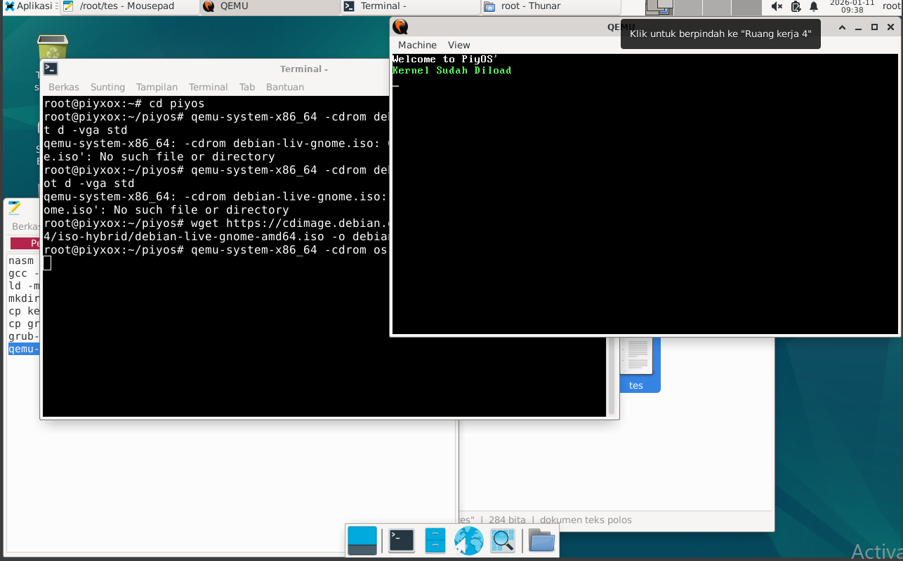

# PiyOS



PiyOS adalah **mini operating system** yang dikembangkan dari nol dengan **kernel custom**, **VGA text mode / GUI minimal**, dan **mini GNU shell**. Sistem ini masih sederhana, cocok untuk belajar OS development dan kernel programming.  

---

## Fitur Utama

1. Boot via **GRUB** dengan menu pilihan kernel  
2. **VGA text mode** & GUI minimal  
3. **Mini GNU shell** dengan beberapa perintah dasar (`help`, `echo`, `clear`)  
4. Bisa **akses BIOS / QEMU firmware**  
5. Realtime **keyboard input**  


---

## Cara Build

1. Ekstrak zip ke linux kalian (saya pakai debian)
2. Masuk ke folder dengan cara
   ```bash
   cd piyos`
3.Lalu copas kode dibawah
```bash
qemu-system-x86_64 -cdrom os.iso`
